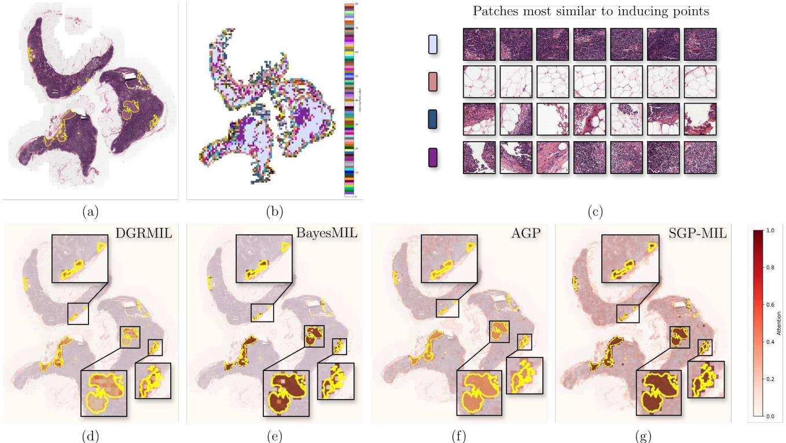

# SGPMIL: Sparse Gaussian Process Multiple Instance Learning

Andreas Lolos1,2 Stergios Christodoulidis3 Maria Vakalopoulou2,3 Jose Dolz4 Aris Moustakas1,2 1University of Athens, Department of Physics 2Archimedes/Athena Research Center 3MICS, CentraleSupelec, Universit ´ e Paris-Saclay ´ 4ETS Montr ´ eal ´

{andreaslolos, arislm}@phys.uoa.gr, stergios.christodoulidis@centralesupelec.fr, maria.vakalopoulou@centralesupelec.fr, jose.dolz@etsmtl.ca

# Abstract

Multiple Instance Learning (MIL) offers a natural solution for settings where only coarse, bag-level labels are available, without having access to instance-level annotations. This is usually the case in digital pathology, which consists of gigapixel sized images. While deterministic attention-based MIL approaches achieve strong bag-level performance, they often overlook the uncertainty inherent in instance relevance. In this paper, we address the lack of uncertainty quantification in instance-level attention scores by introducing SGPMIL, a new probabilistic attention-based MIL framework grounded in Sparse Gaussian Processes (SGP). By learning a posterior distribution over attention scores, SGPMIL enables principled uncertainty estimation, resulting in more reliable and calibrated instance relevance maps. Our approach not only preserves competitive baglevel performance but also significantly improves the quality and interpretability of instance-level predictions under uncertainty. SGPMIL extends prior work by introducing feature scaling in the SGP predictive mean function, leading to faster training, improved efficiency, and enhanced instance-level performance. Extensive experiments on multiple well-established digital pathology datasets highlight the effectiveness of our approach across both bag- and instance-level evaluations. Our code will be made publicly available.

# 1. Introduction

Analyzing whole slide images (WSIs) is a critical task in digital pathology, central to medical diagnostics and treatment planning. Due to their gigapixel scale, WSIs are prohibitively expensive and time-consuming to annotate at the pixel or region level. Multiple Instance Learning (MIL) offers a practical solution by enabling model training using only coarse, slide-level labels, bypassing the need for exhaustive annotations [7, 17, 27, 32]. In the MIL framework, each data point (a “bag”) consists of many instances (e.g., image patches), but only the bag label is provided during training. This setup makes MIL especially well-suited for WSI classification, subtype identification, and survival prediction [17, 25, 36].

Building on recent progress in MIL for WSI analysis, embedding-based MIL models with attention pooling have demonstrated strong performance at the bag level while offering interpretable heatmaps that highlight task-relevant tissue regions [17, 34, 45]. These methods rely on attention mechanisms to weigh instance contributions, yet the resulting scores are often interpreted heuristically as indicators of instance relevance. In this work, we introduce a probabilistic formulation of the attention mechanism by learning a posterior distribution over attention weights. This formulation enables principled prediction uncertainty estimation and enhances the interpretability of instance-level predictions, while maintaining strong bag-level performance.

Recent attention-based MIL aggregation schemes have demonstrated impressive bag-level performance across various metrics [17, 25, 34, 45], on a variety of datasets. These results have been further enhanced by leveraging recent foundation models, which provide powerful instance-level representations. The aforementioned MIL works showcase plotted attention heatmaps of test set cases for explainability purposes, in which the provided attention heatmaps seem to focus on instances of interest which, for example, in a binary classification setting indicate the presence or absence of a positive class instance. While the attained bag-level performance is impressive, attention values are often interpreted as class-specific instance discriminators. We hypothesize that explicitly modeling uncertainty over these attention scores—by learning a posterior distribution—can improve instance-level performance, while preserving strong bag-level accuracy.

Probabilistic deep learning offers principled tools for uncertainty estimation and improved model calibration [12].

This is particularly valuable in MIL, where probabilistic frameworks may clarify both prediction confidence, statistical properties as well as the inner workings of pooling operations [13, 42]. Bayesian extensions of instancebased MIL have been explored to quantify uncertainty, particularly under data scarcity and label noise [13, 28]. Furthermore, bayesian extensions of the embedding-based MIL have explored the performance/explainability gains that one has by inducing uncertainty to the attention scoring mechanism and imposing prior regularization [33, 42]. These approaches typically incorporate variational inference and Monte Carlo (MC) sampling to model distributional uncertainty at the instance and bag level. Moreover, current challenges in probabilistic MIL approaches include numerical instability during training [33], lack extensive evaluation on multiple datasets and tasks with various encoders or require apriory decision on the range of instance spatial correlations in the scoring function [42].

In this paper, we introduce SGPMIL, an efficient and robust probabilistic attention-based MIL framework grounded in Sparse Gaussian Processes. By designing a novel probabilistic formulation, our main contributions are structured along the following axes:

(i) A fast and efficient probabilistic framework. SGPMIL builds upon prior work on Sparse Gaussian Processes for MIL and introduces three key innovations: (1) a feature scaling term in the predictive mean of the learnable attention SGP variational posterior, which improves representational flexibility and adaptation to varying input scales; (2) a more stable and robust sampling strategy from the variational posterior during training, addressing numerical instabilities in Gaussian Process-based MIL approaches; and (3) an interpretable instance-level attention normalization mechanism across attention samples, enabling more consistent and meaningful instance-level predictions under the MIL setting.

(ii) Instance-level performance / Interpretability. Our Sparse Gaussian Process formulation of the variational posterior, combined with the proposed across-sample attention normalization, enables the model to assign high attention values to task-relevant instances in an inherently unsupervised manner. This design not only adheres to the core MIL assumption—where only a subset of instances in a bag contribute to the label—but also enhances interpretability by producing consistent and informative attention maps that reflect the model’s confidence and inductive biases.

(iii) Prediction uncertainty estimation. Our framework provides calibrated uncertainty estimates by leveraging sampling from the variational posterior, enabling principled uncertainty quantification at the slide level. We empirically demonstrate that predictive uncertainty correlates with classification correctness, highlighting its utility in identifying uncertain or failure-prone predictions. This makes the model particularly suitable for deployment in safety-critical scenarios, such as medical image processing.

Extensive experiments across multiple datasets demonstrates on-par bag-level performance on binary classifications tasks, with SGPMIL outperforming leading MIL approaches on multiclass datasets. Furthermore, we provide both intuitive motivation and empirical validation for the hypothesis that the inducing point approach in our MIL formulation captures salient histological morphologies and effectively focuses on task-relevant instances, leading to superior instance-level performance.

# 2. Related Work

# 2.1. Deterministic frameworks

Many embedding-based MIL approaches compute instance-level attention scores through fixed parametric transformations. Ilse et al. [17] introduce attention-based deep MIL (ABMIL), where the slide-level representation is computed as a weighted average of instance embeddings. The attention weights are derived via a gated mechanism, which applies a two-layer neural network combining a tanh and sigmoid activation followed by a dot product, allowing the model to learn instance relevance in a differentiable, end-to-end manner. Lu et al. in Clustering-constrained attention MIL (CLAM) [25] extended the gated attention mechanism by introducing an extra clustering objective via a smooth SVM loss to constrain the patch feature space to being more separable with respect to class characterizing evidence, in various histopathology datasets while releasing a comprehensive toolbox for data pre-processing and model training. Li et al. in Dual-Stream MIL Network (DSMIL) [22] propose a dual-attention mechanism that combines instance-level and bag-level attention, where the most critical instance is selected via a classifier stream and its features guide the aggregation of the remaining patches. This is coupled with multiscale feature extraction and contrastive pretraining, leading to improved tumor detection performance. Shao et al. in Transformer-based MIL (TransMIL) [34] make use of two self-attention heads [39] to weigh the instances and introduce spatial correlations using a novel Pyramid Position Encoding Generator (PPEG) achieving strong performance in bag-level classification metrics. More recent work like DGRMIL [45] model instance correlation by introducing cross-attention across instances and a set of learnable tokens which are trained by a positive instance alignment mechanism and a novel diversity loss term. Despite strong bag-level performance, existing attention based MIL methods rarely assess how well attention mechanisms identify task-relevant instances. Being deterministic, they also lack the capacity to estimate predictive uncertainty—crucial in medical applications. We address these gaps through systematic instance-level evaluation and demonstrate improved instance identification.

# 2.2. Probabilistic frameworks

AGP [33] integrates a Sparse Gaussian Process (SGP) layer within a multi-layer perceptron (MLP) to model attention distributions over instances for classification tasks. Given input embeddings, the SGP layer computes a variational multivariate normal posterior distribution over the attention values associated with each instance in a bag; Monte Carlo (MC) sampling yields multiple attention values, which are used to reweigh the instance embeddings, resulting in multiple samples of bag-level representations that are subsequently classified. The model is trained by maximizing the Evidence Lower Bound (ELBO) with respect to the model parameters. Another related approach is BayesMIL [42], which addresses the interpretability of attention mechanism in MIL by modeling probabilistic instance weights. Specifically, they introduce multiplicative Gaussian noise [20], into the projection layers and the classifier. Furthermore, they propose the Slide-Dependent Patch Regularizer (SDPR), which imposes a prior encouraging attention scores to remain close to zero for negative bags, while allowing values near zero or one for positive bags in binary classification settings. To capture spatial correlations among instance attention distributions, they incorporate a conditional random field (CRF) on top of the learned attention distributions. Despite their promise, existing probabilistic approaches lack evaluations with pathology foundation encoders on cancer datasets, extensive instance-level evaluation on other datasets or rely on fixed spatial smoothing kernels that introduce task-specific inductive biases and require manual tuning [42]. AGP, in particular, faces numerical instabilities and scalability issues on larger datasets, and does not assess instance-level performance. In this work, we address these limitations by introducing a feature scaling term in the mean of the SGP variational posterior distribution, an efficient sampling strategy during training and a in AGP, addressing different instabilities, while conducting a comprehensive evaluation of both bag- and instance-level performance on the widely used public benchmarks.

Gaussian Processes Gaussian Processes (GPs) offer a powerful flexible and elegant framework for regression, as is indicated by an extensive line of works [19, 35, 37]. As non-parametric standalone regressors, they mitigate the need for application-specific model architectures and a priori decision on model complexity [18, 41]. Furthermore, [21, 30] showcase GPs equivalence to infinite-width singlelayer fully-connected neural network with an i.i.d. prior over its parameters and with infinitely wide deep networks respectively which in turn are known to be universal function approximators [16]. Yet, these benefits come at the cost of time and storage complexity of the order of $\mathcal { O } ( n ^ { 3 } )$ and $\mathcal { O } ( n ^ { 2 } )$ respectively mainly due to inverting a $n \times n$ kernel matrix, $n$ being the number of training points, which is prohibitive for large datasets [29]. To overcome the time and storage cost bottleneck, Sparse Gaussian Processes were originally introduced by [35] and subsequently extended to allow for mini-batch training [15]. We leverage the scalable variational GPs framework introduced in [15] to induce uncertainty over instance attention distributions, and incorporate distributional correlation through kernel-based terms, showing that modeling such semantic correlations substantially improves instance-level performance.

# 3. Methodology

# 3.1. Preliminaries

Multiple Instance Learning (MIL) In MIL, the input is a bag of instances, $X _ { i } = \{ x _ { 1 } , . . . , x _ { K _ { i } } \}$ with $\mathbf { k }$ -th instance $\boldsymbol { x } _ { k } \in \mathbb { R } ^ { D }$ , associated with a bag label $Y _ { i } \in \mathbb { N }$ , while the instance labels $\{ y _ { 1 } , \dots , y _ { K _ { i } } \}$ remain unobserved during training; here $K _ { i }$ denotes the number of instances in bag $i$ . A dataset consists of $N$ bag-label pairs, denoted as $\pmb { \mathcal { D } } = ( X _ { i } , Y _ { i } ) _ { i = 1 } ^ { N }$ , and let ${ \mathcal { C } } = \{ 1 , \ldots , C \}$ denote the set of class labels. The standard MIL assumption is defined as:

$$
Y _ { i } = \left\{ { \begin{array} { l l } { 0 , } & { { \mathrm { i f ~ } } \sum _ { k = 1 } ^ { K _ { i } } y _ { k } = 0 } \\ { c , } & { { \mathrm { i f ~ } } \exists i _ { k } { \mathrm { ~ s u c h ~ t h a t ~ } } y _ { k } = c , c \in { \mathcal { C } } } \end{array} } \right.
$$

Sparse Gaussian Processes (SGPs) Following standard notation, given a training dataset $\{ ( X _ { i } , Y _ { i } ) \} _ { i = 1 } ^ { n }$ of size $n$ , where $Y _ { i } = F _ { i } + \epsilon _ { i }$ a noisy observation of the noise-free real-valued latent function $F ( \cdot ) : X \in \mathcal { X } \to \mathbb { R }$ evaluated at $X _ { i }$ and $\epsilon _ { i } \sim \mathcal { N } \left( 0 , \sigma ^ { 2 } \right)$ models independent observation noise, an additional set of m learnable inducing points $\mathcal { Z } = \{ Z _ { i } \} _ { i = 1 } ^ { m }$ , $m \ll n$ are introduced to summarize the information of the entire dataset. These points $Z _ { i } \in { \mathcal { Z } }$ reside in the same space as the inputs $X _ { i } \in { \mathcal { X } }$ and are optimized during training to capture the underlying data distribution. In our formulation, n is the total number of instances across all bags, m is the number of learnable prototypical instance representations and we train the SGP layer using batches of instances, where each batch contains instances from the same bag. Let the vector $\mathbf { F } \in \mathbb { R } ^ { n }$ contain the values of function $F$ evaluated at each training point $X _ { i }$ and the vector $\mathbf { U } \in \mathbb { R } ^ { m }$ be the values of the same function at the points $Z _ { i } \in { \mathcal { Z } }$ . Assuming that the vectors $( \mathbf { F } , \mathbf { U } )$ are jointly gaussian, the SGP model evaluated at finite sets of inputs $( \mathbf { X } , \mathbf { Z } )$

  
Figure 1. SGPMIL architecture overview. On the left, we illustrate the complete processing pipeline: WSIs are segmented and tiled into patches, which are then encoded using a self-supervised pathology foundation model (UNI [5]). The resulting patch embeddings are passed through an attention-based MIL head incorporating a probabilistic SGP mechanism. The attention-weighted embeddings are summed and projected through a trainable MLP. On the right, we highlight the probabilistic attention component. The SGP layer receives the projected embeddings along with learnable inducing point locations and infers a variational posterior over patch-level attention scores. Multiple attention samples are drawn to reweigh the patch embeddings, which are then aggregated into stochastic slide-level representations and classified via a linear layer followed by softmax.

can be characterized by the following equations,

$$
\begin{array} { r } { p ( \mathbf { F } \mid \mathbf { U } ) = \mathcal { N } \Big ( \mathbf { F } \Big | \mu _ { \mathbf { X } } + \Sigma _ { X Z } \Sigma _ { Z Z } ^ { - 1 } ( \mathbf { U } - \mu _ { \mathbf { Z } } ) , } \\ { \Sigma _ { X X } - \Sigma _ { X Z } \Sigma _ { Z Z } ^ { - 1 } \Sigma _ { Z X } \Big ) } \\ { p ( \mathbf { F } , \mathbf { U } ) = \mathcal { N } \left( \left[ \mathbf { U } \right] \Big | \left[ \mu _ { \mathbf { X } } \right] , \left[ \Sigma _ { X X } \quad \Sigma _ { X Z } \right] \right) } \end{array}
$$

where $\pmb { \Sigma } _ { Z Z }$ is a kernel function evaluating interactions between the inducing points, $\Sigma _ { Z X }$ quantifying correlation between inducing and training points and $\pmb { \Sigma } _ { X X }$ between training points. As will be described in the next section, we will use variational inference to approximate the marginal $p \left( \mathbf { F } \right) = { \mathcal { N } } \left( { \boldsymbol { \mu } } _ { \mathbf { X } } , { \boldsymbol { \Sigma } } _ { \mathbf { X } \mathbf { X } } \right)$ . For notation relevance, we will denote from now on $\mathbf { F }$ as $\mathbf { A }$ to indicate the attention vector for instances in a WSI.

# 3.2. SGPMIL: Sparse Gaussian Process MIL

An overview of the SGPMIL pipeline is summarized in Fig. 1. Following the standard attention-based MIL formulation introduced in [17], the learned function is decomposed into three components: a feature extractor, an attention module and a classifier after a pooling operation. The feature extractor maps each instance to a high-dimensional embedding space, $f _ { \mathrm { e } } ~ : ~ x _ { k } \in ~ X _ { i } \mapsto \mathbf { h } _ { k } \in \mathcal { H } _ { i }$ , where $\mathcal { H } _ { i } = \{ h _ { 1 } , . . . , h _ { K _ { i } } \}$ . The attention module is probabilistic: to compute the attention scores, the embeddings are passed through dimensionality-reducing linear layers with appropriate activation functions and then into the SGP layer, which outputs a multivariate normal distribution over the instance-level attention scores. Drawing $N _ { s }$ Monte Carlo (MC) samples from this learnable distribution produces distinct sets of instance weightings. These weighted embeddings are aggregated via summation, resulting in $N _ { s }$ baglevel representations. Each bag-level sample is then passed through a classifier $f _ { \mathrm { c } } : \mathbb { R } ^ { d }  \Delta ^ { C - 1 }$ to produce an estimate of the conditional distribution $p ( Y \mid X )$ . The function decomposition is formally expressed as,

$$
{ \bf p } _ { s } = f _ { \mathrm { c } } \left( \sum _ { k = 1 } ^ { K _ { i } } A _ { s , k } { \bf h } _ { k } \right)
$$

where each $\begin{array} { r } { \mathbf { p _ { s } } \in \Delta ^ { C - 1 } } \end{array}$ denotes the class probability vector for sample $s$ and $A _ { s , k }$ is a matrix where each column contains $s$ samples for each instance $\mathbf { h _ { k } }$ and for which $\begin{array} { l l l } { \frac { 1 } { S } \sum _ { s } A _ { s , k } } & { \in } & { [ 0 , 1 ] } \end{array}$ . For $C$ classes, the $( C - 1 )$ -dimensional probability simplex $\begin{array} { r l } { \Delta ^ { C - 1 } } & { { } = } \end{array}$ $\left\{ \mathbf { p } \in \mathbb { R } ^ { C } : p _ { j } \geq 0 \forall j \in [ C ] , \sum _ { j = 1 } ^ { C } p _ { j } = 1 \right\}$ . In turn, the joint probabilistic bag-level model can be written as,

$$
p \left( \mathbf { Y } , \mathbf { A } , \mathbf { U } \right) = p \left( \mathbf { Y } \mid \mathbf { A } , \mathbf { X } \right) p \left( \mathbf { A } \mid \mathbf { U } , \mathbf { Z } , \mathbf { X } \right) p \left( \mathbf { U } \mid \mathbf { Z } \right)
$$

where $\mathbf { A }$ is the attention random variable, $\mathbf { U }$ are the inducing points and $\mathbf { Z } , \mathbf { X }$ are the learnable inducing point locations and actual data respectively. Following the work of [33], we place a prior over the inducing values $p ( \mathbf { U } ) \ = \ \mathcal { N } \left( \mu _ { \mathbf { U } } , \Sigma _ { \mathbf { Z } \mathbf { Z } } \right)$ . To approximate the intractable joint distribution $p ( \mathbf { A } , \mathbf { U } ) \ = \ p ( \mathbf { A } \ | \ \mathbf { U } , \mathbf { Z } , \mathbf { X } ) p ( \mathbf { U } | \mathbf { Z } )$ in Eq. (5), a variational distribution over the inducing values $q ( \mathbf { U } ) = \mathcal { N } \left( \mathbf { U } \mid \mathbf { m _ { U } } , \mathbf { S _ { Z Z } } \right)$ is considered. This leads to a closed form marginal for the attention distribution $q ( \mathbf { A } ) =$ $\begin{array} { r } { \int _ { \mathbf { U } } p ( \mathbf { A } \mid \mathbf { U } ) q ( \mathbf { U } ) d \mathbf { U } } \end{array}$ which yields,

$$
\begin{array} { r l } & { q ( \mathbf { A } ) = \mathcal { N } \bigg ( \pmb { \mu } _ { \mathbf { X } } + \Sigma _ { \mathbf { X } \mathbf { Z } } \Sigma _ { \mathbf { Z } \mathbf { Z } } ^ { - 1 } ( \mathbf { m } _ { \mathrm { U } } - \pmb { \mu } _ { \mathbf { U } } ) , } \\ & { \qquad \Sigma _ { \mathbf { X } \mathbf { X } } - \Sigma _ { \mathbf { X } \mathbf { Z } } \Sigma _ { \mathbf { Z } \mathbf { Z } } ^ { - 1 } ( \Sigma _ { \mathbf { Z } \mathbf { Z } } - \mathbf { S } _ { \mathbf { Z } \mathbf { Z } } ) \Sigma _ { \mathbf { Z } \mathbf { Z } } ^ { - 1 } \Sigma _ { \mathbf { Z } \mathbf { X } } \bigg ) } \end{array}
$$

In our approach, a learnable linear projection term in the variational posterior mean, defined as $\mu _ { \bf X } = W _ { \bf A } X + b$ . The parameters involved in the optimization include the weights of the projection layers and the classifier, collectively denoted by $W$ ; the projection matrix for the real inputs to the SGP $W _ { \mathbf { A } }$ ; the inducing point set $\mathbf { Z }$ ; the kernel hyperparameters $\theta$ and the variational mean mU. The kernel matrix elements are computed using a scaled Radial Basis Function (RBF) kernel function, defined as $\Sigma _ { i j } =$ $A \exp \left( - ( x _ { i } - x _ { j } ) ^ { \top } \Theta ^ { - 1 } ( x _ { i } - x _ { j } ) \right) + C$ . These components are jointly learned by maximizing the Evidence Lower Bound (ELBO), which is defined as,

$$
\begin{array} { r } { \log p ( Y ) \geq \mathbb { E } _ { q ( \mathbf { A } ) } \left[ \log p ( Y \mid \mathbf { A } ) \right] - \operatorname { K L } \left( q ( \mathbf { U } ) \parallel p ( \mathbf { U } ) \right) , } \end{array}
$$

Assuming that the datapoints (WSIs) are i.i.d., the expectation over the variational posterior $q ( \mathbf { A } )$ can be decomposed and approximated as

$$
\begin{array} { l } { { \displaystyle \mathbb { E } _ { q ( { \bf A } ) } \left[ \log p ( Y \mid { \bf A } ) \right] = \sum _ { i } \mathbb { E } _ { q ( { \bf A } _ { i } ) } \left[ \log p ( Y _ { i } \mid { \bf A } _ { i } ) \right] } \ ~ } \\ { { \displaystyle \simeq \frac { 1 } { N _ { s } } \sum _ { i , s } \log \mathbf { p } _ { i , s } } } \end{array}
$$

where samples drawn from $q ( \mathbf { A } )$ are passed through the remainder of the network, producing samples of the class probability vectors $\mathbf { p } _ { s }$ as defined in Eq. (4). Maximizing Eq. (8) is equivalent to minimizing a standard CrossEntropy loss between predicted and observed class probabilities [10]. For inference, the predictive distribution is $\begin{array} { r } { p ( \mathbf { Y ^ { * } } ) = \int _ { \mathbf { A } } p ( \mathbf { Y ^ { * } } \mid \mathbf { A } ) q ( \mathbf { A } ) d \mathbf { A } } \end{array}$ and is approximated by taking MC samples from the learned variational posterior, propagating through the network and again computing the class probability vector as in Eq. (4). To generate MC samples of the attention scores, we apply the local reparameterization trick, rewriting $\mathbf { A }$ as $\mathbf { A } = m _ { \mathbf { A } } + \sqrt { \mathrm { d i a g } ( \mathbf { S } _ { \mathbf { A } } ) } \odot \epsilon$ with $\mathbf { A } \ \sim \ q ( \mathbf { A } )$ , where $\mathbf { \nabla } m _ { \mathbf { A } }$ and $\mathbf { S _ { A } }$ represent the mean and covariance of the variational distribution respectively and $\epsilon \sim \mathcal { N } ( 0 , I )$ the noise term.

# 3.3. Implementation Details

Our framework, encompassing data preprocessing and model training, is implemented in PyTorch [2] and PyTorch Lightning [9]. Feature extraction utilizes the TRIDENT toolkit and the UNI encoder [5]. For the AGP and SGPMIL models, we employ the AdamW optimizer [24] with a linear warmup followed by a cosine annealing learning rate schedule [14, 23], using a peak learning rate of $6 \times 1 0 ^ { - 4 }$ for the TCGA-NSCLC and CAMELYON16 datasets. All other models are trained using their original optimization settings. For the PANDA and BRACS datasets, all models are trained for a maximum of 20 epochs using the AdamW optimizer with cosine annealing and a maximum learning rate of $1 \times 1 0 ^ { - 4 }$ . AGP and SGPMIL required a slightly higher peak learning rate of $2 \times 1 0 ^ { - 4 }$ to ensure convergence within the same number of epochs. The SGP layer is implemented using GPyTorch [11]. Complete code and instructions will be made publicly available to ensure full reproducibility.

# 4. Experiments

# 4.1. Datasets

CAMELYON16 [8] includes 270 training and 130 test WSIs for breast cancer metastasis detection, with detailed tumor annotations for positive slides. We use 129 test slides due to a corrupted file. WSIs are segmented and patched at $1 0 \times$ magnification [26], using TRIDENT [38,43], with features extracted via the UNI encoder [5]. We follow [25] for 10-fold cross-validation and report mean bag-level performance. Instance-level results use the model with the highest bag-level AUC.

TCGA-NSCLC For the non-small cell lung carcinoma (NSCLC) subtyping task, we utilize hematoxylin and eosin (H&E) stained WSIs from The Cancer Genome Atlas (TCGA) to classify lung adenocarcinoma (LUAD) versus lung squamous cell carcinoma (LUSC) [4, 6]. The current cohort consists of 1,006 slides, with 494 LUAD and 512 LUSC cases. WSIs are segmented and patched at $1 0 \times$ magnification [26], followed by feature extraction using the UNI encoder [5].

PANDA The PANDA dataset consists of 10,609 WSIs of prostate core needle biopsies, each annotated with an ISUP grade (0–5), resulting in a 6-class classification task. We perform 5-fold cross-validation using stratified splits, where each fold maintains approximately 80/5/15 splits per class for training, validation, and testing respectively. WSIs are segmented into non-overlapping $2 2 4 \times 2 2 4$ patches at $2 0 \times$ magnification [36], and patch-level features are extracted using the UNI encoder [5, 36, 44].

BRACS The BRACS dataset [3] comprises 547 WSIs labeled as Benign, Atypical, or Malignant. We the predefined train, validation, and test split provided with the dataset, extract non-overlapping $2 2 4 \times 2 2 4$ patches at $2 0 \times$ magnification [44], and obtain features using the UNI encoder [5].

Table 1. Ablation study on the CAMELYON16 dataset (10-fold cross-validation) evaluating architectural differences to vanilla AGP model. Variants differ in mean parameterization (LM), post-SGP activation (Softmax/Sigmoid), use of covariance diagonal (Diag) and number of inducing points $( N _ { U } )$ . Metrics include WSI/Instance-level balanced accuracy (ACC), AUC and average training/inference time (T/P, in seconds).   

<html><body><table><tr><td></td><td></td><td></td><td></td><td colspan="3">WSI</td><td colspan="2">INSTANCE</td><td>Training/Inference</td></tr><tr><td>LM</td><td></td><td>Post</td><td>Diag N </td><td>ACC</td><td>AUC</td><td>ACE</td><td>AUC</td><td>ACE</td><td>Time (s)</td></tr><tr><td>AGP [33]</td><td>X softmax()</td><td>X</td><td>1680</td><td></td><td></td><td>.858 021 954.29 0890 945</td><td></td><td>.091</td><td>31.06.0</td></tr><tr><td></td><td>X</td><td></td><td></td><td></td><td></td><td></td><td></td><td></td><td></td></tr><tr><td></td><td>σ(.) √ softmax(.)</td><td>X X</td><td>80 80</td><td></td><td></td><td>.936.015 .970.009.049.014 .822</td><td></td><td>.320</td><td>31.0/6.0</td></tr><tr><td></td><td></td><td></td><td></td><td></td><td></td><td>.971.006 .976.007.027.008.821</td><td></td><td>.173</td><td>31.0/6.0</td></tr><tr><td></td><td>√ σ() √ softmax(.)</td><td>√</td><td></td><td>80.973.007.980.009 .024.007.965</td><td></td><td>80.972.014 .979.016 .065.045 .970</td><td></td><td>.103</td><td>31.0/6.0</td></tr><tr><td></td><td></td><td></td><td></td><td></td><td></td><td></td><td></td><td>.070</td><td>9.0/1.0</td></tr><tr><td>SGPMIL</td><td>√ σ()</td><td>J</td><td></td><td></td><td></td><td>16 97106 97002 9043</td><td></td><td>.071</td><td>9.0/1.0</td></tr></table></body></html>

All models are trained using 5 random seeds, and we report the mean and standard deviation of each evaluation metric.

# 4.2. Evaluation Metrics.

For slide-level classification, we report balanced accuracy (ACC), area under the receiver operating characteristic curve (AUC), and adaptive expected calibration error (ACE) [31], capturing both predictive performance and model calibration.

For patch-level evaluation, we follow the methodology of [42], treating the attention scores produced by each model as instance-level probabilities. The area under the ROC curve (AUC) is computed directly from these continuous scores by comparing them against pixel-level ground truth annotations. For threshold-dependent metrics such as accuracy (ACC), we apply thresholding over a range of values and report the best result per model, following the threshold selection strategy proposed in [42].

# 5. Results & Discussion

# 5.1. Ablations

We showcase the performance gains achieved by the modifications introduced in our framework, relative to a baseline implementation of sparse Gaussian processes for MIL [33]. Table 1 showcases the improvement in baglevel performance our contributions have against the vanilla methodology. The ablations systematically vary four components: attention normalization (implemented via softmax or sigmoid), the mean parameterization in the variational posterior (LM), the use of diagonal covariance (Diag), and the number of inducing points $( N _ { \mathbf { U } } )$ . The first improvement over the vanilla AGP model is achieved by introducing relaxed attention normalization, replacing the softmax constraint $\textstyle \sum _ { k } A _ { s , k } \ = \ 1$ with a sigmoid-based expectation constraint $\begin{array} { r } { \frac { 1 } { S } \sum _ { s } A _ { s , k } \ \in \ [ 0 , 1 ] } \end{array}$ . This relaxation allows the model to naturally assign high attention to multiple instances with task-relevant characteristics, yielding initial gains in both bag- and instance-level performance.

Next, we observe a substantial improvement after introducing a feature-scaling term in the variational mean $\mu _ { X } = \mathbf { W _ { A } } X + \mathbf { b }$ , which replaces the constant $\mu _ { \mathbf { X } } = C$ used in AGP. This adjustment improves expressiveness and makes optimization over kernel hyperparameters and inducing point locations $\mathbf { Z }$ more effective. The combination of relaxed normalization and feature scaling leads to further gains, especially in instance-level accuracy and calibration.

Finally, we address the numerical instability and speed bottlenecks of AGP by replacing the full covariance matrix with its diagonal approximation, eliminating the need for Cholesky decomposition during training. This leads to significantly faster and more stable training and inference, without sacrificing predictive performance.

Overall, introducing feature scaling in the variational mean, diagonal covariance approximation, and relaxed attention normalization lead to improved bag-level performance, faster convergence and more focused instance-level attention.

# 5.2. Bag-Level Performance

Fig. 2 reports the performance of SGPMIL and several baselines across the different histopathology datasets and tasks. In particular, breast cancer detection (CAMELYON16), lung cancer subtyping (TCGANSCLC), prostate cancer grading (PANDA), and breast cancer subtyping (BRACS). Both PANDA and BRACS tasks are multiclass.

In CAMELYON16, all models—except vanilla AGP—achieve comparable accuracy and AUC. Notably, BayesMIL and SGPMIL demonstrate superior calibration, with BayesMIL attaining the lowest ACE, consistent with expectations from a probabilistic formulation. For TCGA-NSCLC, performance is uniformly high across models, indicating limited gains from architectural complexity for this binary task.

  
Figure 2. Slide-level results across multiple datasets.

The PANDA dataset presents a greater challenge due to its multi-class nature. Here, our method ranks first in both ACC, AUC and $\kappa$ , outperforming the next-best method by margins of $3 . 3 \%$ , $2 . 2 \%$ and $2 \%$ , respectively, while ranking second in calibration. A similar trend is observed in BRACS, where our approach leads in accuracy and AUC by $3 . 3 \%$ and $1 . 8 \%$ , again ranking second in calibration. We note that DGRMIL was not originally evaluated in multiclass settings. To integrate it, we substitute the binary crossentropy loss with a cross-entropy loss followed by a softmax activation, updating the negative center when the bag belongs to the ’normal’ class and the positive center in any other case.

These results highlight the generalization capabilities of the SGP-based formulation, particularly in complex multiclass scenarios with heterogeneous tissue morphologies.

# 5.3. Instance-Level Localization

Table 2. Instance-level performance on CAMELYON16 and BRACS for each model. Metrics shown: accuracy (ACC), AUC and ACE. Bold denotes best result.   

<html><body><table><tr><td rowspan="2"></td><td colspan="2">CAMELYON16</td><td colspan="2">BRACS</td></tr><tr><td>ACC AUC ACE</td><td></td><td>ACC AUC ACE</td><td></td></tr><tr><td>ABMIL [17] CLAM [25]</td><td>.769 .885</td><td>.216</td><td>.517 .552</td><td>.057</td></tr><tr><td>TransMIL [34]</td><td>.670 .773 .598 .840</td><td>.267 .063</td><td>.521 .576 .713</td><td>.070</td></tr><tr><td>DGRMIL [45]</td><td>.932</td><td>.086</td><td>.863 .733</td><td>.217</td></tr><tr><td>BayesMIL [42] .806</td><td>.754</td><td></td><td>.701</td><td>.165</td></tr><tr><td></td><td>.862</td><td>.182</td><td>.576 .643</td><td>.120</td></tr><tr><td>AGP [33]</td><td>.863 .953</td><td>.080</td><td>.738</td><td>.822 .177</td></tr><tr><td>SGPMIL</td><td>.914 .973</td><td>.051</td><td>.768 .920</td><td>.044</td></tr></table></body></html>

A key strength of our approach lies in its ability to identify relevant instances within each bag. We interpret the attention score as a proxy for the model’s capability to focus on patches with task-specific characteristics. For each dataset, we evaluate the best-performing model across all folds. For ABMIL and CLAM, attention scores are extracted from the gated attention mechanism. In TransMIL, we perform mean fusion of the attention matrices of attention heads within each of the two attention blocks and apply attention roll-out [1] to compute final scores. DGRMIL follows the method described by [45], using the global token attention. For BayesMIL, we perform multiple forward passes to sample attention scores and compute their mean per patch. For AGP and SGPMIL, we derive attention scores by averaging post-activation values—softmax for AGP and sigmoid for SGPMIL—across samples drawn from the respective learned SGP variational posteriors. All attention scores are subsequently normalized to the range $a \in [ 0 , 1 ]$ and evaluated against ground-truth annotations on test-set WSIs. In Table 2, SGPMIL consistently outperforms all baselines by over $3 \%$ in ACC and $2 \%$ in AUC, while providing more calibrated and focused attention on diagnostically salient regions.

# 5.4. Inducing Points Capture Patch Variability

Recent MIL work has highlighted the importance of baglevel representations, noting that noisy instance features can negatively impact classification performance [46]. In our approach, the learnable inducing points act as task-adaptive prototypes that capture salient morphological patterns and core structural features across tissue slides, as shown in Figure 3.

In Figure 3(a), we visualize the slide-level ground truth annotations. In (b), we show a label map where each patch embedding is assigned the label of its most similar inducing point (based on cosine similarity). This visualization reveals that distinct inducing points specialize in capturing different tissue types—e.g., tumor regions, dense stromal tissue, and interface zones such as tumor-stroma boundaries. Finally, in Figure 3(c), we display the top-7 most similar patches for the inducing points that match the largest number of patches. The visual coherence across patches associated with each inducing point demonstrates that the model learns meaningful and morphologically consistent prototypes.

  
Figure 3. Normalized attention heatmaps for all models. Scores are scaled to the interval [0, 1]. For DGRMIL, we use the attention scores of the cls token, while for BayesMIL, AGP and SGPMIL we plot the mean attention score per patch. The yellow contours correspond to the ground-truth annotations

# 5.5. Prediction Uncertainty Estimation

  
Figure 4. Predictive uncertainty for correctly and incorrectly classified WSIs in the BRACS (left) and PANDA (right) datasets. Each pair of boxplots represents the distribution of standard errors of the predicted class probabilities for correct (green) and incorrect (red) predictions. A statistically significant difference in uncertainty is observed for both datasets $( p < 0 . 0 5 )$ , based on a two-sample Welch’s $t$ -test [40].

In Figure 4, we visualize the prediction uncertainty for correctly and incorrectly classified WSIs. Specifically, we compute the standard deviation of the predicted class probabilities across multiple samples and compare the resulting distributions using a two-sample Welch’s $t$ -test [40]. We consider BRACS and PANDA datasets as for CAMELYON16 and TCGA-NSCLC, the incorrectly predicted slides are very few to properly estimate and compare the variance between sets (high ACC, AUC). We find a statistically significant difference $( p \ : < \ : 0 . 0 5 )$ in predictive uncertainty between correct and incorrect predictions across datasets. This indicates that higher uncertainty is associated with misclassified slides, suggesting that our model’s uncertainty estimates are well-calibrated—an essential property for deployment in safety-critical clinical workflows.

# 6. Conclusion

We introduced SGPMIL, a robust and scalable probabilistic attention-based MIL framework built on sparse Gaussian processes, designed for improved instance- and bag-level prediction in high-dimensional histopathology tasks. By learning a variational posterior over attention scores and leveraging a flexible kernel, SGPMIL captures semantic relationships among instances while enabling principled uncertainty quantification. Our method achieves leading instance-level performance, competitive bag-level accuracy, and addresses key limitations of prior probabilistic MIL approaches, particularly in terms of numerical stability and scalability. Our code will be made publicly available to support reproducibility and further research. A limitation of this work is that we focus exclusively on unimodal visual inputs. Extending SGPMIL to multimodal MIL settings—such as integrating clinical or genomic metadata alongside WSIs—remains an exciting direction for future research.

Acknowledgements This work has been partially supported by project MIS 5154714 of the National Recovery and Resilience Plan Greece 2.0 funded by the European Union under the NextGenerationEU Program. Hardware resources were granted with the support of GRNET.

# References

[1] Samira Abnar and Willem Zuidema. Quantifying attention flow in transformers. arXiv preprint arXiv:2005.00928, 2020. 7   
[2] Jason Ansel, Edward Yang, Horace He, Natalia Gimelshein, Animesh Jain, Michael Voznesensky, Bin Bao, Peter Bell, David Berard, Evgeni Burovski, Geeta Chauhan, Anjali Chourdia, Will Constable, Alban Desmaison, Zachary DeVito, Elias Ellison, Will Feng, Jiong Gong, Michael Gschwind, Brian Hirsh, Sherlock Huang, Kshiteej Kalambarkar, Laurent Kirsch, Michael Lazos, Mario Lezcano, Yanbo Liang, Jason Liang, Yinghai Lu, CK Luk, Bert Maher, Yunjie Pan, Christian Puhrsch, Matthias Reso, Mark Saroufim, Marcos Yukio Siraichi, Helen Suk, Michael Suo, Phil Tillet, Eikan Wang, Xiaodong Wang, William Wen, Shunting Zhang, Xu Zhao, Keren Zhou, Richard Zou, Ajit Mathews, Gregory Chanan, Peng Wu, and Soumith Chintala. PyTorch 2: Faster Machine Learning Through Dynamic Python Bytecode Transformation and Graph Compilation. In 29th ACM International Conference on Architectural Support for Programming Languages and Operating Systems, Volume 2 (ASPLOS ’24). ACM, Apr. 2024. 5   
[3] Nadia Brancati, Anna Maria Anniciello, Pushpak Pati, Daniel Riccio, Giosue Scognamiglio, Guillaume Jaume, \` Giuseppe De Pietro, Maurizio Di Bonito, Antonio Foncubierta, Gerardo Botti, et al. Bracs: A dataset for breast carcinoma subtyping in h&e histology images. Database, 2022:baac093, 2022. 5   
[4] Joshua D Campbell, Anton Alexandrov, Jaegil Kim, Jeremiah Wala, Alice H Berger, Chandra Sekhar Pedamallu, Sachet A Shukla, Guangwu Guo, Angela N Brooks, Bradley A Murray, et al. Distinct patterns of somatic genome alterations in lung adenocarcinomas and squamous cell carcinomas. Nature genetics, 48(6):607–616, 2016. 5   
[5] Richard J Chen, Tong Ding, Ming Y Lu, Drew FK Williamson, Guillaume Jaume, Andrew H Song, Bowen Chen, Andrew Zhang, Daniel Shao, Muhammad Shaban, et al. Towards a general-purpose foundation model for computational pathology. Nature Medicine, 30(3):850–862, 2024. 4, 5   
[6] Lee AD Cooper, Elizabeth G Demicco, Joel H Saltz, Reid T Powell, Arvind Rao, and Alexander J Lazar. Pancancer insights from the cancer genome atlas: the pathologist’s perspective. The Journal of pathology, 244(5):512–524, 2018. 5   
[7] Thomas G Dietterich, Richard H Lathrop, and Tomas´ Lozano-Perez. Solving the multiple instance problem with ´ axis-parallel rectangles. Artificial intelligence, 89(1-2):31– 71, 1997. 1 [8] Babak Ehteshami Bejnordi, Mitko Veta, Paul Johannes van Diest, Bram van Ginneken, Nico Karssemeijer, Geert Litjens, Jeroen A. W. M. van der Laak, , and the CAMELYON16 Consortium. Diagnostic assessment of deep learning algorithms for detection of lymph node metastases in women with breast cancer. JAMA, 318(22):2199–2210, 12 2017. 5   
[9] William Falcon and The PyTorch Lightning team. PyTorch Lightning, Mar. 2019. 5   
[10] Yarin Gal and Zoubin Ghahramani. Dropout as a bayesian approximation: Representing model uncertainty in deep learning. In ICML, pages 1050–1059. PMLR, 2016. 5   
[11] Jacob R. Gardner, Geoff Pleiss, David Bindel, Kilian Q. Weinberger, and Andrew Gordon Wilson. Gpytorch: Blackbox matrix-matrix gaussian process inference with gpu acceleration, 2021. 5   
[12] Zoubin Ghahramani. Probabilistic machine learning and artificial intelligence. Nature, 521(7553):452–459, 2015. 1   
[13] Manuel Haußmann, Fred A Hamprecht, and Melih Kandemir. Variational bayesian multiple instance learning with gaussian processes. In Proceedings of the IEEE conference on computer vision and pattern recognition, pages 6570– 6579, 2017. 2   
[14] Tong He, Zhi Zhang, Hang Zhang, Zhongyue Zhang, Junyuan Xie, and Mu Li. Bag of tricks for image classification with convolutional neural networks, 2018. 5   
[15] James Hensman, Alexander Matthews, and Zoubin Ghahramani. Scalable variational gaussian process classification. In Artificial intelligence and statistics, pages 351–360. PMLR, 2015. 3   
[16] Kurt Hornik, Maxwell Stinchcombe, and Halbert White. Multilayer feedforward networks are universal approximators. Neural networks, 2(5):359–366, 1989. 3   
[17] Maximilian Ilse, Jakub Tomczak, and Max Welling. Attention-based deep multiple instance learning. In ICML, pages 2127–2136. PMLR, 2018. 1, 2, 4, 7   
[18] Kalvik Jakkala. Deep gaussian processes: A survey. arXiv preprint arXiv:2106.12135, 2021. 3   
[19] Minyoung Kim and Fernando De la Torre. Gaussian processes multiple instance learning. In ICML, pages 535–542. Citeseer, 2010. 3   
[20] Durk P Kingma, Tim Salimans, and Max Welling. Variational dropout and the local reparameterization trick. Advances in neural information processing systems, 28, 2015. 3   
[21] Jaehoon Lee, Yasaman Bahri, Roman Novak, Samuel S. Schoenholz, Jeffrey Pennington, and Jascha Sohl-Dickstein. Deep neural networks as gaussian processes, 2018. 3   
[22] Bin Li, Yin Li, and Kevin W Eliceiri. Dual-stream multiple instance learning network for whole slide image classification with self-supervised contrastive learning. In Proceedings of the IEEE/CVF conference on computer vision and pattern recognition, pages 14318–14328, 2021. 2   
[23] Ilya Loshchilov and Frank Hutter. Sgdr: Stochastic gradient descent with warm restarts, 2017. 5   
[24] Ilya Loshchilov and Frank Hutter. Decoupled weight decay regularization, 2019. 5   
[25] Ming Y Lu, Drew FK Williamson, Tiffany Y Chen, Richard J Chen, Matteo Barbieri, and Faisal Mahmood. Data-efficient and weakly supervised computational pathology on wholeslide images. Nature biomedical engineering, 5(6):555–570, 2021. 1, 2, 5, 7   
[26] Ali Mammadov, Lo¨ıc Le Folgoc, Julien Adam, Anne Buronfosse, Gilles Hayem, Guillaume Hocquet, and Pietro Gori. Self-supervision enhances instance-based multiple instance learning methods in digital pathology: a benchmark study. Journal of Medical Imaging, 12(6):061404–061404, 2025. 5   
[27] Oded Maron and Tomas Lozano-P´ erez. A framework for´ multiple-instance learning. Advances in neural information processing systems, 10, 1997. 1   
[28] Pablo Morales-Alvarez, Arne Schmidt, Jos ´ e Miguel ´ Hernandez-Lobato, and Rafael Molina. Introducing instance ´ label correlation in multiple instance learning. application to cancer detection on histopathological images. Pattern Recognition, 146:110057, 2024. 2   
[29] Kevin P Murphy. Probabilistic machine learning: Advanced topics. MIT press, 2023. 3   
[30] Radford M Neal. Bayesian learning for neural networks, volume 118. Springer Science & Business Media, 2012. 3   
[31] Jeremy Nixon, Michael W Dusenberry, Linchuan Zhang, Ghassen Jerfel, and Dustin Tran. Measuring calibration in deep learning. In CVPR workshops, volume 2, 2019. 6   
[32] Gwenole Quellec, Guy Cazuguel, B ´ eatrice Cochener, and ´ Mathieu Lamard. Multiple-instance learning for medical image and video analysis. IEEE reviews in biomedical engineering, 10:213–234, 2017. 1   
[33] Arne Schmidt, Pablo Morales-Alvarez, and Rafael Molina. Probabilistic attention based on gaussian processes for deep multiple instance learning. IEEE Transactions on Neural Networks and Learning Systems, 2023. 2, 3, 4, 6, 7   
[34] Zhuchen Shao, Hao Bian, Yang Chen, Yifeng Wang, Jian Zhang, Xiangyang Ji, et al. Transmil: Transformer based correlated multiple instance learning for whole slide image classification. Advances in neural information processing systems, 34:2136–2147, 2021. 1, 2, 7   
[35] Edward Snelson and Zoubin Ghahramani. Sparse gaussian processes using pseudo-inputs. Advances in neural information processing systems, 18, 2005. 3   
[36] Andrew H Song, Richard J Chen, Tong Ding, Drew FK Williamson, Guillaume Jaume, and Faisal Mahmood. Morphological prototyping for unsupervised slide representation In pν d: the IEEE/CVF Conference on Computer Vision and Pattern Recognition, pages 11566–11578, 2024. 1, 5   
[37] Michalis Titsias. Variational learning of inducing variables in sparse gaussian processes. In Artificial intelligence and statistics, pages 567–574. PMLR, 2009. 3   
[38] Anurag Vaidya, Andrew Zhang, Guillaume Jaume, Andrew H Song, Tong Ding, Sophia J Wagner, Ming Y Lu, Paul Doucet, Harry Robertson, Cristina Almagro-Perez, et al. Molecular-driven foundation model for oncologic pathology. arXiv preprint arXiv:2501.16652, 2025. 5   
[39] Ashish Vaswani, Noam Shazeer, Niki Parmar, Jakob Uszkoreit, Llion Jones, Aidan N. Gomez, Lukasz Kaiser, and Illia Polosukhin. Attention is all you need, 2023. 2   
[40] Bernard L Welch. The generalization of ‘student’s’problem when several different population varlances are involved. Biometrika, 34(1-2):28–35, 1947. 8   
[41] Christopher KI Williams and Carl Edward Rasmussen. Gaussian processes for machine learning, volume 2. MIT press Cambridge, MA, 2006. 3   
[42] Cui Yufei, Ziquan Liu, Xiangyu Liu, Xue Liu, Cong Wang, Tei-Wei Kuo, Chun Jason Xue, and Antoni B Chan. Bayesmil: A new probabilistic perspective on attention-based multiple instance learning for whole slide images. In The Eleventh International Conference on Learning Representations, 2022. 2, 3, 6, 7   
[43] Andrew Zhang, Guillaume Jaume, Anurag Vaidya, Tong Ding, and Faisal Mahmood. Accelerating data processing and benchmarking of ai models for pathology. arXiv preprint arXiv:2502.06750, 2025. 5   
[44] Jingwei Zhang, Anh Tien Nguyen, Xi Han, Vincent QuocHuy Trinh, Hong Qin, Dimitris Samaras, and Mahdi S Hosseini. 2dmamba: Efficient state space model for image representation with applications on giga-pixel whole slide image classification. arXiv preprint arXiv:2412.00678, 2024. 5   
[45] Wenhui Zhu, Xiwen Chen, Peijie Qiu, Aristeidis Sotiras, Abolfazl Razi, and Yalin Wang. Dgr-mil: Exploring diverse global representation in multiple instance learning for whole slide image classification, 2024. 1, 2, 7   
[46] Wenhui Zhu, Peijie Qiu, Xiwen Chen, Zhangsihao Yang, Aristeidis Sotiras, Abolfazl Razi, and Yalin Wang. How effective can dropout be in multiple instance learning? arXiv preprint arXiv:2504.14783, 2025. 7

# SGPMIL: Sparse Gaussian Process Multiple Instance Learning supplementary material

Table S1: Slide-level performance on CAMELYON16, TCGA-NSCLC, PANDA and BRACS datasets. Metrics are mean (top) and standard deviation (bottom).   

<html><body><table><tr><td rowspan="2"></td><td colspan="2">CAMELYON16</td><td colspan="2">TCGA-NSCLC</td><td colspan="4">PANDA</td><td colspan="2">BRACS</td></tr><tr><td>ACCAUC</td><td>ACE</td><td>ACCAUC</td><td></td><td>ACE</td><td>ACC</td><td>K</td><td></td><td></td><td>ACE ACC AUC ACE</td></tr><tr><td rowspan="2">ABMIL</td><td>.964.990</td><td>.032</td><td></td><td>.953.973</td><td>.039</td><td></td><td></td><td></td><td></td><td>.834 .910 .044 .694 .852 .175</td></tr><tr><td>.010 .005</td><td>.011</td><td>.003</td><td>.009</td><td>.008</td><td>.064</td><td>.028</td><td>.015</td><td>.010 .025</td><td>.007</td></tr><tr><td rowspan="2">CLAM</td><td>.978 .986</td><td>.021</td><td></td><td>.934.953</td><td>.056</td><td></td><td>.867 .927 .031</td><td></td><td>.699 .850.183</td><td></td></tr><tr><td>.007 .007</td><td>.007</td><td>.014</td><td>.004</td><td>.016</td><td>.061</td><td>.025</td><td>.018</td><td>.034 .021</td><td>.011</td></tr><tr><td rowspan="2">TransMIL .962</td><td>.980</td><td>.029</td><td></td><td>.950.970</td><td>.046</td><td></td><td></td><td></td><td>.827 .911 .043 .676 .826 .186</td><td></td></tr><tr><td>.009 .004</td><td>.014</td><td>.017</td><td>.012</td><td>.019</td><td>.074</td><td>.030</td><td>.021</td><td>.005 .032</td><td>.012</td></tr><tr><td rowspan="2">DGRMIL</td><td>.960.980</td><td>.045</td><td></td><td>.947.974</td><td>.038</td><td></td><td></td><td>.843.933 .036</td><td>.703.818.186</td><td></td></tr><tr><td>.012 .010</td><td>.016</td><td>.024</td><td>.011</td><td>.022</td><td>.097</td><td>.047</td><td>.025</td><td>.033 .035</td><td>.023</td></tr><tr><td rowspan="2">BayesMIL</td><td>.976 .981</td><td>.020</td><td></td><td>.953.973</td><td>.033</td><td></td><td></td><td>.850.926 .031</td><td>.648 .829 .183</td><td></td></tr><tr><td>.007 .006</td><td>.007</td><td>.023</td><td>.021</td><td>.017</td><td>.060</td><td>.031</td><td>.016</td><td>.058 .022</td><td>.028</td></tr><tr><td rowspan="2">AGP</td><td>.883.954</td><td>.069</td><td></td><td>.948 .976</td><td>.048</td><td></td><td></td><td></td><td>.802 .906 .026 .634 .830 .134</td><td></td></tr><tr><td>.021 .019</td><td>.013</td><td>.026</td><td>.014</td><td>.025</td><td>.086</td><td>.047</td><td>.013</td><td>.030 .010</td><td>.014</td></tr><tr><td rowspan="2">SGPMIL .980 .986</td><td></td><td>.021</td><td></td><td>.955 .973</td><td>.047</td><td></td><td></td><td></td><td>.900 .955 .028 .736 .870 .142</td><td></td></tr><tr><td>.007 .005</td><td>.005</td><td>.021</td><td>.014</td><td>.027</td><td>.065</td><td>.037</td><td>.022</td><td>.029 .026</td><td>.032</td></tr></table></body></html>

<html><body><table><tr><td></td><td colspan="3">WSI</td><td colspan="3">INSTANCE</td></tr><tr><td>U</td><td>ACC</td><td>AUC</td><td>ACE</td><td>ACC</td><td>AUC</td><td>ACE</td></tr><tr><td>16</td><td>.971.016</td><td>.977.020</td><td>.045.022</td><td>.893</td><td>.963</td><td>.271</td></tr><tr><td>32</td><td>.979.010</td><td>.985.005</td><td>.026.010</td><td>.880</td><td>.970</td><td>.046</td></tr><tr><td>64</td><td>.964.013</td><td>.981.009</td><td>.041.016</td><td>.832</td><td>.910</td><td>.210</td></tr><tr><td>80</td><td>.980.007</td><td>.986.005</td><td>.021.005</td><td>.914</td><td>.973</td><td>.051</td></tr></table></body></html>

Table S2: Performance of SGPMIL on the CAMELYON16 dataset for varying numbers of inducing points ( $U$ ). Slide-level metrics (WSI) and instance-level metrics are reported. Instance-level accuracy (ACC) is computed using the optimal binarization threshold for each model, following the evaluation protocol introduced in BayesMIL.

  
Figure S1: Additional attention heatmaps on CAMELYON16. Ground-truth tumor annotations are overlaid as yellow contours.

  
Figure S2: Additional inducing point label maps. Left: CAMELYON16 test set WSIs with groundtruth tumor annotations (yellow contours). Middle: label maps where each patch embedding is assigned to its most similar inducing point based on cosine similarity. Right: top-5 most similar patches for selected inducing points. These visualizations highlight how inducing points specialize in different tissue morphologies, including tumor, stroma, and interface regions.